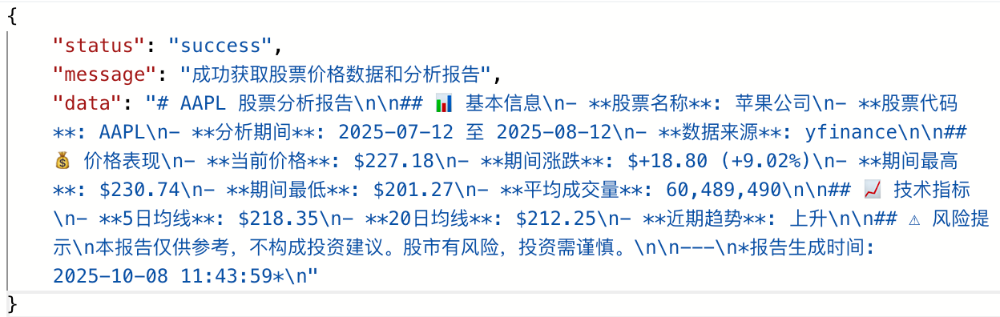
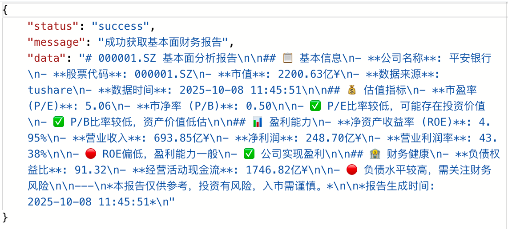
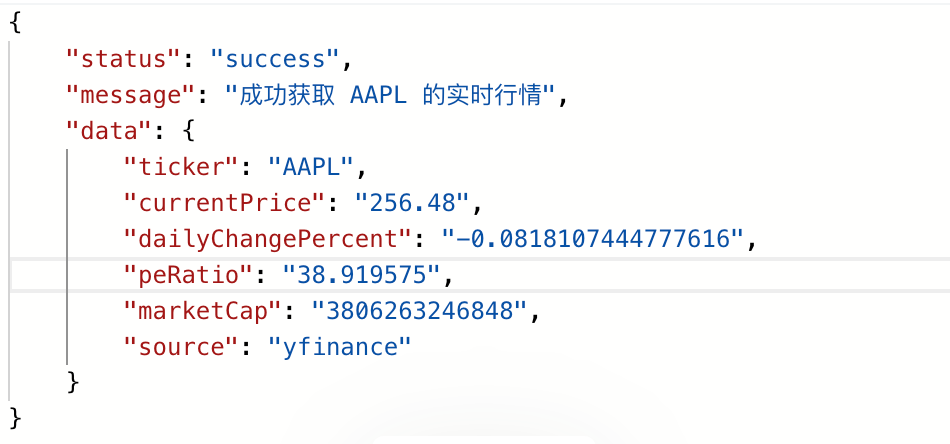
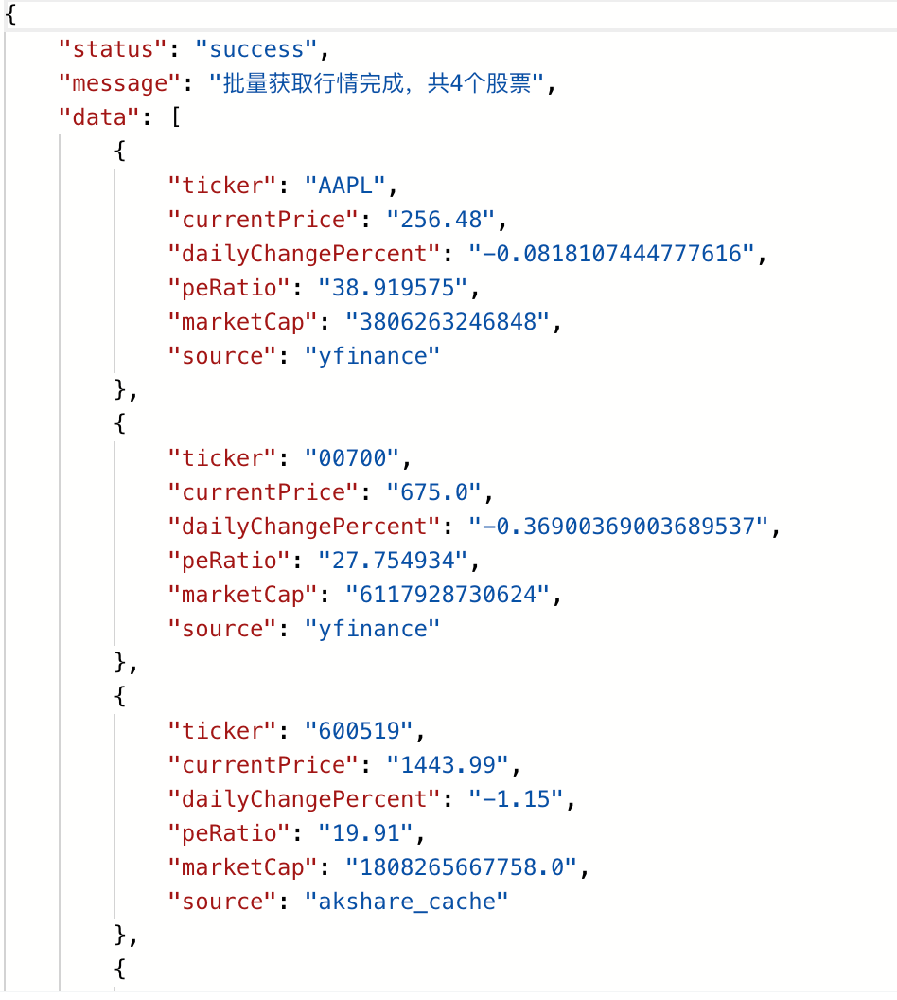
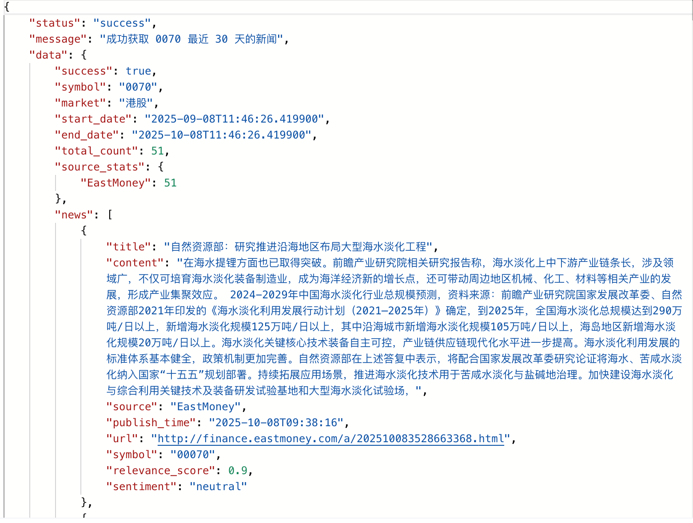
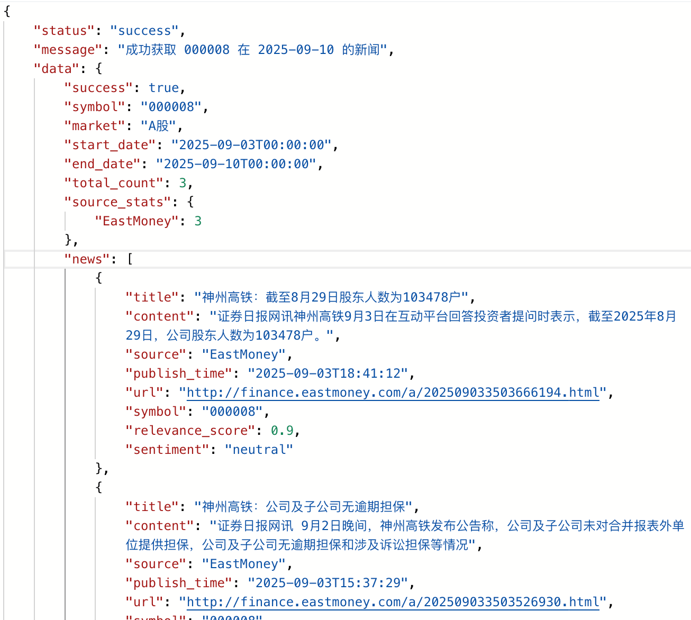
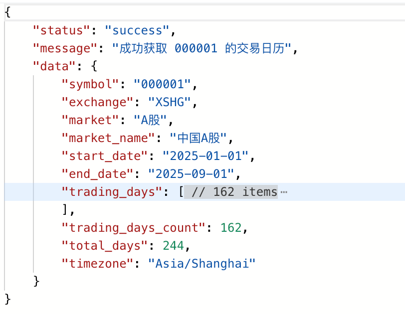

<div align="center">

# 📈 Stock MCP Server

> **基于 Model Context Protocol 的智能股票数据服务**  
> 一站式获取 A股/港股/美股实时数据 + AI 驱动的深度分析

[](https://www.python.org/downloads/)
[](https://www.docker.com/)
[](LICENSE)

[快速开始](#-快速开始) • [功能特性](#-核心功能) • [API 文档](docs/API.md) • [配置指南](docs/GUIDE.md)

</div>

---

## ✨ 为什么选择 Stock MCP？

- 🌐 **全球市场覆盖** - 一键接入 A股、港股、美股数据
- 🤖 **AI 智能分析** - 新闻情绪分析、深度研究报告、智能搜索
- 🚀 **开箱即用** - Docker 一键部署，5分钟启动服务
- 📊 **多数据源融合** - AKShare、Tushare、yFinance、Finnhub 智能聚合
- 💾 **高性能缓存** - Redis 加速 + 自动降级，稳定可靠

---

## 🚀 快速开始

```bash
# 1. 克隆项目
git clone <your-repo-url> && cd stock-mcp

# 2. 配置环境变量（必需：TUSHARE_TOKEN）
cp .env.example .env && vim .env

# 3. 一键启动
docker-compose up -d

# 4. 访问服务
open http://localhost:9998/docs
```

> 💡 **查看样例报告**: 想了解 AI 分析能力?查看 [样例报告](docs/sample-reports/) 了解完整的技术分析和基本面报告格式

**🎯 5分钟体验核心功能：**
```bash
# 查询茅台历史价格及AI分析
curl "http://localhost:9998/stock/price?symbol=600519&start_date=2024-01-01&end_date=2025-01-01"

# 获取苹果实时行情
curl "http://localhost:9998/api/stock/news?symbol=AAPL"

# 查询股票基本面数据
curl "http://localhost:9998/api/stock/fundamental?symbol=000008&curr_date=2025-06-01"

# 批量查询多只股票
curl -X POST "http://localhost:9998/api/stock/quotes" \
  -H "Content-Type: application/json" \
  -d '{"symbols": ["AAPL", "TSLA", "MSFT"]}'
```

---

## 🎯 核心功能

### 📋 API 接口概览

| 分类           | 接口           | 端点                                    | 描述                |
| -------------- | -------------- | --------------------------------------- | ------------------- |
| 📊 **行情数据** | Market Price   | `GET /stock/price`                      | 历史价格+AI分析报告 |
|                | Stock Quote    | `GET /api/stock/news`                   | 实时行情快照        |
|                | Stock Quotes   | `POST /api/stock/quotes`                | 批量行情查询        |
| 💼 **基本面**   | Fundamental    | `GET /api/stock/fundamental`            | 财务基本面数据      |
| 📰 **新闻资讯** | Stock News     | `GET /api/stock/news`                   | 最新股票新闻        |
|                | News by Date   | `GET /api/stock/news/date`              | 指定日期新闻        |
| 📅 **交易日历** | Trading Days   | `GET /api/calendar/trading-days`        | 交易日列表          |
|                | Is Trading Day | `GET /api/calendar/is-trading-day`      | 交易日检查          |
|                | Trading Hours  | `GET /api/calendar/trading-hours`       | 交易时间信息        |
|                | Exchanges      | `GET /api/calendar/supported-exchanges` | 支持的交易所        |

> 💡 **提示**: 所有接口支持 A股、港股、美股三大市场  
> 📚 **详细文档**: 启动后访问 http://localhost:9998/docs

---

<table>
<tr>
<td width="50%">

### 📊 数据查询能力
- ✅ **实时行情** - 分钟级价格/成交量
- ✅ **历史数据** - K线图、复权价格
- ✅ **财务报表** - 资产负债表、现金流
- ✅ **技术指标** - MACD、RSI、布林带
- ✅ **资金流向** - 主力资金、北向资金

</td>
<td width="50%">

### 🤖 AI 增强
- 🔍 **智能搜索** - Tavily 语义搜索
- 📰 **情绪分析** - 多源新闻聚合 + 评分
- 📈 **深度研究** - AI 生成研究报告
- 💡 **决策辅助** - 数据驱动的投资建议
- 🌐 **多语言支持** - 中英文自动识别

</td>
</tr>
</table>

---

## ⚙️ 配置说明

### 核心配置（`.env` 文件）

```bash
# 【必填】A股数据访问（申请地址：https://tushare.pro/）
TUSHARE_TOKEN=your_token_here

# 【可选】代理配置（访问美股数据时推荐）
HTTP_PROXY=http://127.0.0.1:7890
HTTPS_PROXY=http://127.0.0.1:7890

# 【可选】增强功能
TAVILY_API_KEY=your_key     # AI 搜索和研究
FINNHUB_API_KEY=your_key    # 增强新闻数据
NEWS_API_KEY=your_key       # 新闻聚合
```

<details>
<summary>📖 <b>完整配置说明</b></summary>

| 配置项          | 说明               | 默认值                         |
| --------------- | ------------------ | ------------------------------ |
| `REDIS_HOST`    | Redis 主机         | `redis`（Docker）/ `localhost` |
| `CACHE_ENABLED` | 是否启用缓存       | `true`                         |
| `CACHE_TTL`     | 缓存过期时间（秒） | `3600`                         |

详见：[配置指南](docs/GUIDE.md#配置详解)
</details>

---

## 📡 API 接口文档

### 🎨 交互式文档

启动服务后访问以下地址查看完整的 Swagger UI 文档：
- **Swagger UI**: http://localhost:9998/docs
- **ReDoc**: http://localhost:9998/redoc

### 📋 样例报告

查看完整的 AI 分析报告样例：
- 📊 **技术分析报告**
  - [贵州茅台 (600519)](docs/sample-reports/market_report_600519.md) - A股白酒龙头技术分析
  - [腾讯控股 (0700)](docs/sample-reports/market_report_0700.md) - 港股科技股技术分析
  - [苹果 (AAPL)](docs/sample-reports/market_report_AAPL.md) - 美股科技巨头技术分析
- 💼 **基本面分析报告**
  - [贵州茅台基本面 (600519)](docs/sample-reports/fundamental_report_600519.md) - 财务指标深度分析
  - [腾讯控股基本面 (0700)](docs/sample-reports/fundamental_report_0700.md) - 港股财务数据分析
- 📁 **原始数据样例**
  - [贵州茅台财务数据 (JSON)](docs/sample-reports/fundamental_data_600519.json) - 完整财务数据结构

---

### 📊 股票数据接口

<details open>
<summary><b>1️⃣ 市场行情分析 - Market Price</b></summary>

#### 接口信息
- **路径**: `GET /stock/price`
- **描述**: 获取指定股票的历史价格数据及AI分析报告

#### 请求参数
| 参数名          | 类型   | 必填 | 说明             | 示例             |
| --------------- | ------ | ---- | ---------------- | ---------------- |
| `symbol`        | string | 是   | 股票代码         | `000001`, `AAPL` |
| `start_date`    | string | 否   | 开始日期         | `2024-07-13`     |
| `end_date`      | string | 否   | 结束日期         | `2025-07-13`     |
| `Authorization` | string | 否   | 认证令牌(Header) | `a7f3518b-...`   |

#### 响应示例
```json
{
  "status": "success",
  "message": "成功获取股票价格数据和分析报告",
  "data": "# AAPL 股票分析报告\n\n## 📊 基本信息\n- **股票名称**: 苹果公司\n- **股票代码**: AAPL\n- **分析期间**: 2025-07-12 至 2025-08-12\n\n## 💰 价格表现\n- **当前价格**: $227.18\n- **期间涨跌**: $+18.80 (+9.02%)\n- **期间最高**: $230.74\n- **期间最低**: $201.27\n- **平均成交量**: 60,489,490\n\n## 📈 技术指标\n- **5日均线**: $218.35\n- **20日均线**: $212.25\n- **近期趋势**: 上升"
}
```

#### 使用示例
```bash
curl -X GET "http://localhost:9998/stock/price?symbol=AAPL&start_date=2024-07-13&end_date=2025-07-13" \
  -H "Authorization: a7f3518b-2983-4d29-bd1d-15a13e470903"
```



</details>

<details>
<summary><b>2️⃣ 基本面数据 - Stock Fundamental</b></summary>

#### 接口信息
- **路径**: `GET /api/stock/fundamental`
- **描述**: 获取股票基本面财务数据

#### 请求参数
| 参数名          | 类型   | 必填 | 说明             | 示例               |
| --------------- | ------ | ---- | ---------------- | ------------------ |
| `symbol`        | string | 是   | 股票代码         | `000008`, `600519` |
| `curr_date`     | string | 否   | 查询日期         | `2025-06-01`       |
| `Authorization` | string | 否   | 认证令牌(Header) | `a7f3518b-...`     |

#### 使用示例
```bash
curl -X GET "http://localhost:9998/api/stock/fundamental?symbol=000008&curr_date=2025-06-01" \
  -H "Authorization: a7f3518b-2983-4d29-bd1d-15a13e470903"
```



</details>

<details>
<summary><b>3️⃣ 实时行情 - Stock Quote</b></summary>

#### 接口信息
- **路径**: `GET /api/stock/news`
- **描述**: 获取股票实时行情快照

#### 请求参数
| 参数名          | 类型   | 必填 | 说明             | 示例             |
| --------------- | ------ | ---- | ---------------- | ---------------- |
| `symbol`        | string | 是   | 股票代码         | `000001`, `AAPL` |
| `Authorization` | string | 否   | 认证令牌(Header) | `a7f3518b-...`   |

#### 响应示例
```json
{
  "status": "success",
  "message": "成功获取 AAPL 的实时行情",
  "data": {
    "ticker": "AAPL",
    "currentPrice": "256.48",
    "dailyChangePercent": "-0.0818107444777616",
    "peRatio": "38.919575",
    "marketCap": "3806263246848",
    "source": "yfinance"
  }
}
```

#### 使用示例
```bash
curl -X GET "http://localhost:9998/api/stock/news?symbol=AAPL" \
  -H "Authorization: a7f3518b-2983-4d29-bd1d-15a13e470903"
```



</details>

<details>
<summary><b>4️⃣ 批量行情查询 - Stock Quotes</b></summary>

#### 接口信息
- **路径**: `POST /api/stock/quotes`
- **描述**: 批量查询多个股票的实时行情

#### 请求参数
| 参数名          | 类型   | 必填 | 说明             |
| --------------- | ------ | ---- | ---------------- |
| `symbols`       | array  | 是   | 股票代码列表     |
| `Authorization` | string | 否   | 认证令牌(Header) |

#### 使用示例
```bash
curl -X POST "http://localhost:9998/api/stock/quotes" \
  -H "Content-Type: application/json" \
  -H "Authorization: a7f3518b-2983-4d29-bd1d-15a13e470903" \
  -d '{"symbols": ["AAPL", "TSLA", "MSFT"]}'
```



</details>

---

### 📰 新闻数据接口

<details>
<summary><b>5️⃣ 股票新闻 - Stock News</b></summary>

#### 接口信息
- **路径**: `GET /api/stock/news`
- **描述**: 获取指定股票的最新新闻

#### 请求参数
| 参数名          | 类型   | 必填 | 说明             | 示例             |
| --------------- | ------ | ---- | ---------------- | ---------------- |
| `symbol`        | string | 是   | 股票代码         | `000001`, `AAPL` |
| `Authorization` | string | 否   | 认证令牌(Header) | `a7f3518b-...`   |

#### 使用示例
```bash
curl -X GET "http://localhost:9998/api/stock/news?symbol=000001" \
  -H "Authorization: a7f3518b-2983-4d29-bd1d-15a13e470903"
```



</details>

<details>
<summary><b>6️⃣ 指定日期新闻 - News by Date</b></summary>

#### 接口信息
- **路径**: `GET /api/stock/news/date`
- **描述**: 获取指定日期范围内的股票新闻

#### 请求参数
| 参数名          | 类型    | 必填 | 说明             | 示例           |
| --------------- | ------- | ---- | ---------------- | -------------- |
| `symbol`        | string  | 是   | 股票代码         | `000001`       |
| `target_date`   | string  | 是   | 目标日期         | `2025-09-10`   |
| `days_before`   | integer | 否   | 向前查询天数     | `7`            |
| `Authorization` | string  | 否   | 认证令牌(Header) | `a7f3518b-...` |

#### 使用示例
```bash
curl -X GET "http://localhost:9998/api/stock/news/date?symbol=000001&target_date=2025-09-10&days_before=7" \
  -H "Authorization: a7f3518b-2983-4d29-bd1d-15a13e470903"
```



</details>

---

### 📅 交易日历接口

<details>
<summary><b>7️⃣ 交易日列表 - Trading Days</b></summary>

#### 接口信息
- **路径**: `GET /api/calendar/trading-days`
- **描述**: 获取指定时间范围内的交易日列表

#### 请求参数
| 参数名          | 类型   | 必填 | 说明             | 示例           |
| --------------- | ------ | ---- | ---------------- | -------------- |
| `symbol`        | string | 是   | 股票代码         | `000001`       |
| `start_date`    | string | 是   | 开始日期         | `2025-01-01`   |
| `end_date`      | string | 是   | 结束日期         | `2025-09-01`   |
| `Authorization` | string | 否   | 认证令牌(Header) | `a7f3518b-...` |

#### 使用示例
```bash
curl -X GET "http://localhost:9998/api/calendar/trading-days?symbol=000001&start_date=2025-01-01&end_date=2025-09-01" \
  -H "Authorization: a7f3518b-2983-4d29-bd1d-15a13e470903"
```



</details>

<details>
<summary><b>8️⃣ 交易日检查 - Is Trading Day</b></summary>

#### 接口信息
- **路径**: `GET /api/calendar/is-trading-day`
- **描述**: 检查指定日期是否为交易日

#### 请求参数
| 参数名          | 类型   | 必填 | 说明             | 示例           |
| --------------- | ------ | ---- | ---------------- | -------------- |
| `symbol`        | string | 是   | 股票代码         | `000001`       |
| `check_date`    | string | 是   | 检查日期         | `2025-09-30`   |
| `Authorization` | string | 否   | 认证令牌(Header) | `a7f3518b-...` |

#### 使用示例
```bash
curl -X GET "http://localhost:9998/api/calendar/is-trading-day?symbol=000001&check_date=2025-09-30" \
  -H "Authorization: a7f3518b-2983-4d29-bd1d-15a13e470903"
```

</details>

<details>
<summary><b>9️⃣ 交易时间 - Trading Hours</b></summary>

#### 接口信息
- **路径**: `GET /api/calendar/trading-hours`
- **描述**: 获取指定日期的交易时间信息

#### 请求参数
| 参数名          | 类型   | 必填 | 说明             | 示例           |
| --------------- | ------ | ---- | ---------------- | -------------- |
| `symbol`        | string | 是   | 股票代码         | `000001`       |
| `check_date`    | string | 是   | 检查日期         | `2025-09-30`   |
| `Authorization` | string | 否   | 认证令牌(Header) | `a7f3518b-...` |

#### 使用示例
```bash
curl -X GET "http://localhost:9998/api/calendar/trading-hours?symbol=000001&check_date=2025-09-30" \
  -H "Authorization: a7f3518b-2983-4d29-bd1d-15a13e470903"
```

</details>

<details>
<summary><b>🔟 支持的交易所 - Supported Exchanges</b></summary>

#### 接口信息
- **路径**: `GET /api/calendar/supported-exchanges`
- **描述**: 获取系统支持的所有交易所列表

#### 请求参数
| 参数名          | 类型   | 必填 | 说明             |
| --------------- | ------ | ---- | ---------------- |
| `Authorization` | string | 否   | 认证令牌(Header) |

#### 响应示例
```json
{
  "status": "success",
  "message": "成功获取支持的交易所列表",
  "data": {
    "total_count": 200,
    "regions": {
      "美国": ["NYSE", "NASDAQ"],
      "中国": ["XSHG", "XSHE"],
      "欧洲": ["XPAR", "XLON"],
      "亚太": ["NSE", "TSE"],
      "加拿大": ["TSX"]
    },
    "all_exchanges": ["NYSE", "NASDAQ", "XSHG", "XSHE", "..."]
  }
}
```

#### 使用示例
```bash
curl -X GET "http://localhost:9998/api/calendar/supported-exchanges" \
  -H "Authorization: a7f3518b-2983-4d29-bd1d-15a13e470903"
```


</details>

---

### 🔐 认证说明

所有API接口均支持可选的 `Authorization` Header 进行身份验证：

```bash
-H "Authorization: your-api-token-here"
```

**获取Token**: 请联系管理员或在配置文件中设置自定义Token。

---

### 📊 快速测试

使用以下命令快速测试主要接口：

```bash
# 查询茅台股价
curl "http://localhost:9998/stock/price?symbol=600519&start_date=2024-01-01&end_date=2025-01-01"

# 获取苹果实时行情
curl "http://localhost:9998/api/stock/news?symbol=AAPL"

# 检查今天是否为交易日
curl "http://localhost:9998/api/calendar/is-trading-day?symbol=000001&check_date=$(date +%Y-%m-%d)"

# 获取所有支持的交易所
curl "http://localhost:9998/api/calendar/supported-exchanges"
```

---

### 📖 API 设计规范

本项目API遵循以下设计原则：

✅ **RESTful风格** - 使用标准HTTP方法(GET/POST)  
✅ **统一响应格式** - 所有接口返回统一的JSON结构  
✅ **详细错误信息** - 错误响应包含明确的错误码和描述  
✅ **OpenAPI 3.0** - 完整的API规范文档([查看](stock-mcp.openapi.json))  
✅ **自动文档生成** - Swagger UI + ReDoc双文档支持

---

## 🐳 Docker 部署

### 服务架构

| 端口   | 服务       | 说明                        |
| ------ | ---------- | --------------------------- |
| `9998` | FastAPI    | RESTful API + Swagger 文档  |
| `9999` | MCP Server | Model Context Protocol 服务 |
| `6379` | Redis      | 内部缓存（不对外暴露）      |

### 常用命令

```bash
# 启动服务
docker-compose up -d

# 查看日志
docker-compose logs -f stock-mcp

# 停止服务
docker-compose down

# 重启服务
docker-compose restart

# 重新构建
docker-compose up -d --build
```

---

## 🛠️ 故障排查

<details>
<summary><b>❌ Redis 连接失败</b></summary>

```bash
# 检查配置
cat .env | grep REDIS_HOST
# 确保 Docker 环境使用: REDIS_HOST=redis

# 检查 Redis 状态
docker-compose ps redis
```
</details>

<details>
<summary><b>❌ yFinance 超时</b></summary>

```bash
# 检查代理配置
cat .env | grep PROXY
# Docker 环境应使用: HTTP_PROXY=http://host.docker.internal:7890
```
</details>

<details>
<summary><b>❌ Tushare 权限错误</b></summary>

确保 Token 有效且已配置到 `.env` 文件：
```bash
grep TUSHARE_TOKEN .env
```
</details>

**更多问题**：[完整故障排查指南](docs/GUIDE.md#故障排查)

---

## 📚 文档

- [📡 完整 API 文档](docs/API.md) - 所有接口详细说明、参数、示例
- [💡 API 使用示例](docs/API_EXAMPLES.md) - 实际场景的代码示例
- [📖 使用指南](docs/GUIDE.md) - 配置、部署、最佳实践
- [🔧 开发文档](docs/DEVELOPMENT.md) - 架构设计、二次开发
- [🌐 OpenAPI 规范](stock-mcp.openapi.json) - 标准API规范文件
- [💻 Swagger UI](http://localhost:9998/docs) - 交互式API测试(服务启动后访问)

---

## 🤝 参与贡献

欢迎提交 Issue 和 Pull Request！

```bash
# 1. Fork 项目
# 2. 创建特性分支
git checkout -b feature/amazing-feature

# 3. 提交代码
git commit -m "Add: amazing feature"

# 4. 推送并创建 PR
git push origin feature/amazing-feature
```

---

## 📄 开源协议

MIT License - 详见 [LICENSE](LICENSE)

---

<div align="center">

### 🙏 致谢

本项目基于以下优秀开源项目构建

[MCP](https://modelcontextprotocol.io/) • [FastAPI](https://fastapi.tiangolo.com/) • [AKShare](https://akshare.akfamily.xyz/) • [Tushare](https://tushare.pro/) • [yFinance](https://github.com/ranaroussi/yfinance) • [Tavily](https://tavily.com/)

---

**⭐️ 如果对你有帮助，请给个 Star ⭐️**

</div>
