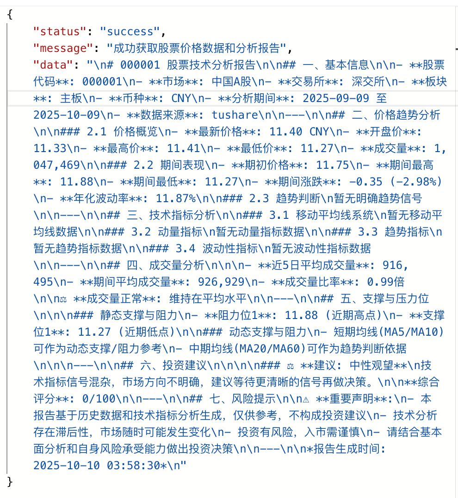
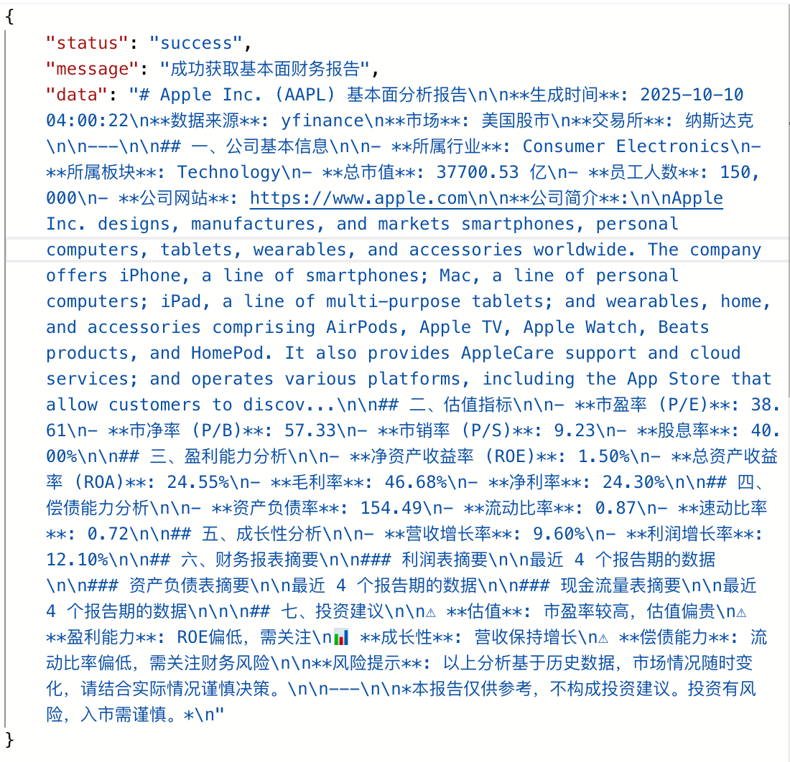
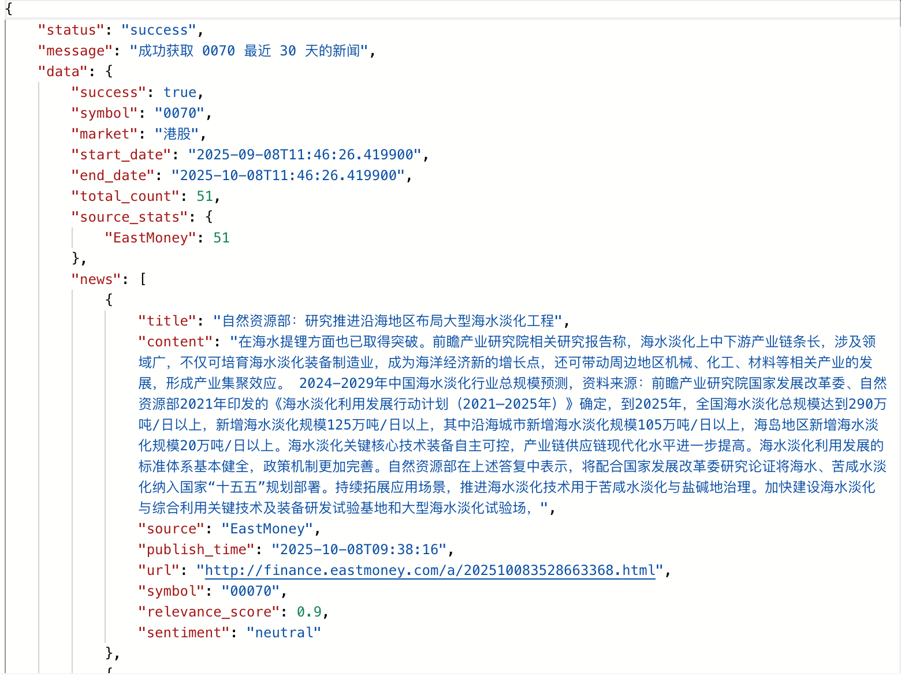

# 📡 Stock MCP API 完整文档

## 目录

- [快速开始](#快速开始)
- [认证机制](#认证机制)
- [响应格式](#响应格式)
- [股票数据接口](#股票数据接口)
  - [市场行情分析](#1-市场行情分析)
  - [基本面数据](#2-基本面数据)
  - [实时行情](#3-实时行情)
  - [批量行情查询](#4-批量行情查询)
- [新闻数据接口](#新闻数据接口)
  - [股票新闻](#5-股票新闻)
  - [指定日期新闻](#6-指定日期新闻)
- [交易日历接口](#交易日历接口)
  - [交易日列表](#7-交易日列表)
  - [交易日检查](#8-交易日检查)
  - [交易时间](#9-交易时间)
  - [支持的交易所](#10-支持的交易所)
- [错误处理](#错误处理)
- [最佳实践](#最佳实践)

---

## 快速开始

### 基础URL

```
http://localhost:9998
```

### 通用请求头

```http
Content-Type: application/json
Authorization: your-api-token (可选)
```

### 快速测试

```bash
# 健康检查
curl http://localhost:9998/health

# 查询股票行情
curl "http://localhost:9998/stock/price?symbol=AAPL"
```

---

## 认证机制

### Header 认证

所有接口支持可选的 Bearer Token 认证：

```bash
curl -H "Authorization: a7f3518b-2983-4d29-bd1d-15a13e470903" \
  http://localhost:9998/api/stock/news?symbol=AAPL
```

### 获取Token

在 `.env` 文件中配置 `API_TOKEN` 或联系管理员获取。

---

## 响应格式

### 成功响应

```json
{
  "status": "success",
  "message": "操作成功描述",
  "data": { /* 具体数据 */ }
}
```

### 错误响应

```json
{
  "status": "error",
  "message": "错误详细描述",
  "error_code": "ERROR_CODE",
  "timestamp": "2025-01-01T12:00:00Z"
}
```

---

## 股票数据接口

### 1. 市场行情分析

获取股票历史价格数据及AI生成的分析报告。

#### 请求

```http
GET /stock/price
```

#### 参数

| 参数       | 类型   | 必填 | 说明                 | 示例                      |
| ---------- | ------ | ---- | -------------------- | ------------------------- |
| symbol     | string | ✅    | 股票代码             | `000001`, `AAPL`, `00700` |
| start_date | string | ❌    | 开始日期(YYYY-MM-DD) | `2024-07-13`              |
| end_date   | string | ❌    | 结束日期(YYYY-MM-DD) | `2025-07-13`              |

#### 示例

```bash
curl "http://localhost:9998/stock/price?symbol=AAPL&start_date=2024-01-01&end_date=2025-01-01"
```

#### 响应

```json
{
  "status": "success",
  "message": "成功获取股票价格数据和分析报告",
  "data": "# AAPL 股票分析报告\n\n## 📊 基本信息\n- **股票名称**: 苹果公司\n- **股票代码**: AAPL\n- **分析期间**: 2024-01-01 至 2025-01-01\n\n## 💰 价格表现\n- **当前价格**: $227.18\n- **期间涨跌**: $+18.80 (+9.02%)\n- **期间最高**: $230.74\n- **期间最低**: $201.27\n- **平均成交量**: 60,489,490\n\n## 📈 技术指标\n- **5日均线**: $218.35\n- **20日均线**: $212.25\n- **近期趋势**: 上升\n\n## ⚠️ 风险提示\n本报告仅供参考，不构成投资建议。"
}
```

#### 截图



---

### 2. 基本面数据

获取股票的财务基本面数据。

#### 请求

```http
GET /api/stock/fundamental
```

#### 参数

| 参数      | 类型   | 必填 | 说明                 | 示例               |
| --------- | ------ | ---- | -------------------- | ------------------ |
| symbol    | string | ✅    | 股票代码             | `000008`, `600519` |
| curr_date | string | ❌    | 查询日期(YYYY-MM-DD) | `2025-06-01`       |

#### 示例

```bash
curl "http://localhost:9998/api/stock/fundamental?symbol=000008&curr_date=2025-06-01"
```

#### 响应

```json
{
  "status": "success",
  "data": {
    "symbol": "000008",
    "company_name": "公司名称",
    "pe_ratio": 15.8,
    "pb_ratio": 2.3,
    "roe": 0.18,
    "total_assets": 1000000000,
    "total_liabilities": 600000000,
    "revenue": 500000000,
    "net_profit": 80000000
  }
}
```

#### 截图



---

### 3. 实时行情

获取股票的实时行情快照。

#### 请求

```http
GET /api/stock/news
```

#### 参数

| 参数   | 类型   | 必填 | 说明     | 示例             |
| ------ | ------ | ---- | -------- | ---------------- |
| symbol | string | ✅    | 股票代码 | `000001`, `AAPL` |

#### 示例

```bash
curl "http://localhost:9998/api/stock/news?symbol=AAPL"
```

#### 响应

```json
{
  "status": "success",
  "message": "成功获取 AAPL 的实时行情",
  "data": {
    "ticker": "AAPL",
    "currentPrice": "256.48",
    "dailyChangePercent": "-0.0818107444777616",
    "peRatio": "38.919575",
    "marketCap": "3806263246848",
    "source": "yfinance"
  }
}
```

#### 截图


---

### 4. 批量行情查询

批量查询多个股票的实时行情。

#### 请求

```http
POST /api/stock/quotes
```

#### 请求体

```json
{
  "symbols": ["AAPL", "TSLA", "MSFT"]
}
```

#### 示例

```bash
curl -X POST "http://localhost:9998/api/stock/quotes" \
  -H "Content-Type: application/json" \
  -d '{"symbols": ["AAPL", "TSLA", "MSFT"]}'
```

#### 响应

```json
{
  "status": "success",
  "data": [
    {
      "symbol": "AAPL",
      "price": 256.48,
      "change_percent": -0.08
    },
    {
      "symbol": "TSLA",
      "price": 412.35,
      "change_percent": 2.15
    },
    {
      "symbol": "MSFT",
      "price": 425.67,
      "change_percent": 0.56
    }
  ]
}
```

#### 截图


---

## 新闻数据接口

### 5. 股票新闻

获取指定股票的最新新闻。

#### 请求

```http
GET /api/stock/news
```

#### 参数

| 参数   | 类型   | 必填 | 说明     | 示例             |
| ------ | ------ | ---- | -------- | ---------------- |
| symbol | string | ✅    | 股票代码 | `000001`, `AAPL` |

#### 示例

```bash
curl "http://localhost:9998/api/stock/news?symbol=000001"
```

#### 响应

```json
{
  "status": "success",
  "data": {
    "news": [
      {
        "title": "新闻标题",
        "summary": "新闻摘要",
        "url": "https://news.example.com/article",
        "published_at": "2025-01-01T10:00:00Z",
        "source": "财经新闻"
      }
    ]
  }
}
```

#### 截图



---

### 6. 指定日期新闻

获取指定日期范围内的股票新闻。

#### 请求

```http
GET /api/stock/news/date
```

#### 参数

| 参数        | 类型    | 必填 | 说明                 | 示例         |
| ----------- | ------- | ---- | -------------------- | ------------ |
| symbol      | string  | ✅    | 股票代码             | `000001`     |
| target_date | string  | ✅    | 目标日期(YYYY-MM-DD) | `2025-09-10` |
| days_before | integer | ❌    | 向前查询天数(默认7)  | `7`          |

#### 示例

```bash
curl "http://localhost:9998/api/stock/news/date?symbol=000001&target_date=2025-09-10&days_before=7"
```

#### 响应

```json
{
  "status": "success",
  "data": {
    "target_date": "2025-09-10",
    "date_range": {
      "start": "2025-09-03",
      "end": "2025-09-10"
    },
    "news_count": 15,
    "news": [
      {
        "title": "新闻标题",
        "date": "2025-09-09",
        "summary": "新闻内容摘要"
      }
    ]
  }
}
```

#### 截图


---

## 交易日历接口

### 7. 交易日列表

获取指定时间范围内的交易日列表。

#### 请求

```http
GET /api/calendar/trading-days
```

#### 参数

| 参数       | 类型   | 必填 | 说明                 | 示例         |
| ---------- | ------ | ---- | -------------------- | ------------ |
| symbol     | string | ✅    | 股票代码             | `000001`     |
| start_date | string | ✅    | 开始日期(YYYY-MM-DD) | `2025-01-01` |
| end_date   | string | ✅    | 结束日期(YYYY-MM-DD) | `2025-09-01` |

#### 示例

```bash
curl "http://localhost:9998/api/calendar/trading-days?symbol=000001&start_date=2025-01-01&end_date=2025-09-01"
```

#### 响应

```json
{
  "status": "success",
  "data": {
    "symbol": "000001",
    "date_range": {
      "start": "2025-01-01",
      "end": "2025-09-01"
    },
    "total_days": 163,
    "trading_days": [
      "2025-01-02",
      "2025-01-03",
      "2025-01-06",
      "..."
    ]
  }
}
```

#### 截图


---

### 8. 交易日检查

检查指定日期是否为交易日。

#### 请求

```http
GET /api/calendar/is-trading-day
```

#### 参数

| 参数       | 类型   | 必填 | 说明                 | 示例         |
| ---------- | ------ | ---- | -------------------- | ------------ |
| symbol     | string | ✅    | 股票代码             | `000001`     |
| check_date | string | ✅    | 检查日期(YYYY-MM-DD) | `2025-09-30` |

#### 示例

```bash
curl "http://localhost:9998/api/calendar/is-trading-day?symbol=000001&check_date=2025-09-30"
```

#### 响应

```json
{
  "status": "success",
  "data": {
    "symbol": "000001",
    "date": "2025-09-30",
    "is_trading_day": true,
    "day_of_week": "Monday",
    "exchange": "XSHG"
  }
}
```

---

### 9. 交易时间

获取指定日期的交易时间信息。

#### 请求

```http
GET /api/calendar/trading-hours
```

#### 参数

| 参数       | 类型   | 必填 | 说明                 | 示例         |
| ---------- | ------ | ---- | -------------------- | ------------ |
| symbol     | string | ✅    | 股票代码             | `000001`     |
| check_date | string | ✅    | 检查日期(YYYY-MM-DD) | `2025-09-30` |

#### 示例

```bash
curl "http://localhost:9998/api/calendar/trading-hours?symbol=000001&check_date=2025-09-30"
```

#### 响应

```json
{
  "status": "success",
  "data": {
    "symbol": "000001",
    "date": "2025-09-30",
    "is_trading_day": true,
    "market_open": "09:30",
    "market_close": "15:00",
    "sessions": [
      {
        "name": "morning",
        "start": "09:30",
        "end": "11:30"
      },
      {
        "name": "afternoon",
        "start": "13:00",
        "end": "15:00"
      }
    ]
  }
}
```

---

### 10. 支持的交易所

获取系统支持的所有交易所列表。

#### 请求

```http
GET /api/calendar/supported-exchanges
```

#### 参数

无

#### 示例

```bash
curl "http://localhost:9998/api/calendar/supported-exchanges"
```

#### 响应

```json
{
  "status": "success",
  "message": "成功获取支持的交易所列表",
  "data": {
    "total_count": 200,
    "regions": {
      "美国": ["NYSE", "NASDAQ"],
      "中国": ["XSHG", "XSHE"],
      "欧洲": ["XPAR", "XLON"],
      "亚太": ["NSE", "TSE", "HKEX"],
      "加拿大": ["TSX"]
    },
    "all_exchanges": [
      "NYSE", "NASDAQ", "XSHG", "XSHE", "XPAR", "XLON",
      "NSE", "TSE", "HKEX", "TSX", "..."
    ]
  }
}
```

#### 截图


---

## 错误处理

### 错误码表

| 错误码                | HTTP状态码 | 说明           | 解决方案                      |
| --------------------- | ---------- | -------------- | ----------------------------- |
| `INVALID_SYMBOL`      | 400        | 无效的股票代码 | 检查股票代码格式              |
| `DATE_FORMAT_ERROR`   | 400        | 日期格式错误   | 使用YYYY-MM-DD格式            |
| `UNAUTHORIZED`        | 401        | 未授权访问     | 提供有效的Authorization Token |
| `NOT_FOUND`           | 404        | 资源不存在     | 检查请求的资源路径            |
| `RATE_LIMIT_EXCEEDED` | 429        | 请求频率超限   | 降低请求频率                  |
| `INTERNAL_ERROR`      | 500        | 服务器内部错误 | 联系技术支持                  |

### 错误示例

```json
{
  "status": "error",
  "message": "无效的股票代码格式",
  "error_code": "INVALID_SYMBOL",
  "timestamp": "2025-01-01T12:00:00Z",
  "details": {
    "symbol": "INVALID",
    "expected_format": "A股6位数字/美股字母代码"
  }
}
```

---

## 最佳实践

### 1. 股票代码格式

- **A股**: 6位数字，如 `000001`, `600519`
- **美股**: 大写字母，如 `AAPL`, `TSLA`
- **港股**: 5位数字，如 `00700`, `01810`

### 2. 日期格式

统一使用 ISO 8601 格式：`YYYY-MM-DD`

```bash
✅ 正确: 2025-01-01
❌ 错误: 01/01/2025, 2025-1-1
```

### 3. 请求频率

建议每秒不超过 10 次请求，避免触发限流。

### 4. 缓存策略

- 历史数据默认缓存 1 小时
- 实时行情缓存 1 分钟
- 基本面数据缓存 24 小时

### 5. 批量查询优化

使用批量接口而非循环单次请求：

```bash
# ✅ 推荐
curl -X POST /api/stock/quotes -d '{"symbols": ["AAPL", "TSLA", "MSFT"]}'

# ❌ 不推荐
for symbol in AAPL TSLA MSFT; do
  curl /api/stock/news?symbol=$symbol
done
```

### 6. 错误重试

建议实现指数退避重试策略：

```python
import time
import requests

def fetch_with_retry(url, max_retries=3):
    for i in range(max_retries):
        try:
            response = requests.get(url)
            response.raise_for_status()
            return response.json()
        except Exception as e:
            if i == max_retries - 1:
                raise
            time.sleep(2 ** i)  # 1s, 2s, 4s
```

---

## 附录

### OpenAPI 规范

完整的 OpenAPI 3.0 规范文件: [stock-mcp.openapi.json](../stock-mcp.openapi.json)

### 交互式文档

- **Swagger UI**: http://localhost:9998/docs
- **ReDoc**: http://localhost:9998/redoc

### 相关文档

- [完整使用指南](GUIDE.md)
- [开发文档](DEVELOPMENT.md)
- [故障排查](GUIDE.md#故障排查)

---

<div align="center">

**📧 技术支持**: [提交 Issue](https://github.com/your-repo/issues)  
**📖 返回首页**: [README.md](../README.md)

</div>
